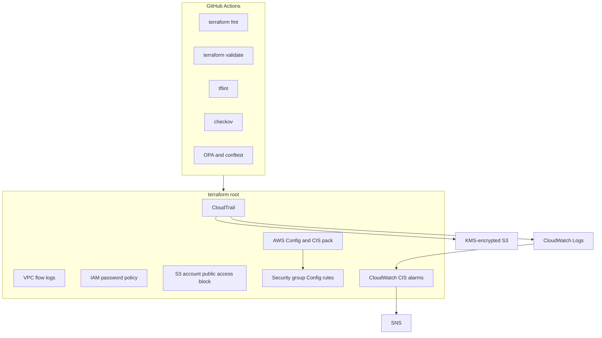

<div align="center">

# COMPLIANCE-AS-CODE-FRAMEWORK

Automate AWS CIS Foundations controls with Terraform, and keep non-compliant changes out of the pipeline.

[](https://github.com/lloredia/Compliance-as-Code-Framework/actions/workflows/policy.yml)

</div>

Terraform modules for a single-account AWS baseline, plus GitHub Actions policy checks. Prowler remains the scanner; this repo stores a redacted summary instead of raw scan files.

## Current compliance status

**Before.** A Prowler scan of the target account, with identifiers removed, reported **367 findings: 127 passed (34.6%), 237 failed (64.6%), and 3 manual**. The largest failure groups were EC2 (68), CloudTrail (53), and the organization services that were not enabled (IAM Access Analyzer, AWS Config, Macie, and Security Hub, 17 each). Full service and severity tables are in [docs/baseline-summary.md](docs/baseline-summary.md).

**After.** This stack codifies the controls below. It is not a second scan, so it does not claim a new pass rate. Apply it, run Prowler locally, and compare with `scripts/analyze-prowler.py`.

| Area | What the stack does |
| --- | --- |
| Logging | Multi-region CloudTrail with log-file validation, KMS, CloudWatch Logs, and an SNS notification topic |
| Network | VPC flow logs for every VPC in the region, encrypted at rest |
| Identity | IAM account password policy at the CIS 1.8–1.11 floor (14 characters, 90-day age, 24-password memory) |
| Storage | Account-level S3 Block Public Access, encrypted delivery buckets, and an explicit list of pre-existing buckets to encrypt |
| Detection | AWS Config recorder, a CIS-aligned conformance pack, and Config rules `restricted-ssh` and `restricted-common-ports` |
| Monitoring | CloudWatch metric filters and alarms for CIS 4.1–4.15, published to SNS |

Access Analyzer, Macie, Security Hub, and root MFA are still operator tasks. They show up in the baseline and are listed under next steps.

## Architecture



`terraform/` is the only root module. Reusable modules live in `modules/`. The old `terraform/live/` tree duplicated the root and called modules with the wrong inputs, so it was removed.

## Quick start

Requirements: Terraform 1.6.x, AWS credentials with rights to create the resources above, and Python 3.11+ if you want the summary script. Prowler is only needed for a live scan.

```bash
cp terraform/terraform.tfvars.example terraform/terraform.tfvars
cd terraform
terraform init -backend=false
terraform plan
terraform apply
```

`terraform init -backend=false` keeps state on disk. That is fine for a first pass. For anything you keep, use the remote backend in the next section. `terraform.tfvars` is gitignored.

After apply, scan locally and summarize without committing the raw report:

```bash
./scripts/check-compliance.sh
# or, if you already have a JSON report:
python3 scripts/analyze-prowler.py path/to/prowler-output.json
python3 scripts/analyze-prowler.py --compare --before before.json --after after.json
```

## Remote state

Copy `terraform/backend.hcl.example` to `terraform/backend.hcl`, create the S3 bucket and DynamoDB lock table described in that file, then:

```bash
cd terraform
terraform init -backend-config=backend.hcl
```

The backend block is partial on purpose. CI runs `terraform init -backend=false` and `terraform validate`, so pull requests do not need AWS credentials or a state bucket.

## Policy as code

Pull requests and pushes to `main` run:

- `terraform fmt -check -recursive`
- `terraform init -backend=false` and `terraform validate`
- `tflint`
- `checkov` on the Terraform
- `opa test` and `conftest` against example `terraform show -json` plans
- `ruff` and `pytest` for `scripts/analyze-prowler.py`

Rego rules in `policy/terraform.rego` reject plans that open SSH or RDP to the internet, turn off S3 Block Public Access, or create a CloudTrail that is single-region or missing log-file validation. Check a real plan the same way:

```bash
cd terraform
terraform plan -out=tfplan
terraform show -json tfplan > plan.json
conftest test --policy ../policy/terraform.rego plan.json
```

The workflow does not apply infrastructure and does not call AWS.

## Security notes

- Do not commit `*.tfstate*`, `*.tfvars`, `.terraform/`, or Prowler output. `.gitignore` covers those paths. State and scan files contain account IDs and resource names.
- Remote state should be encrypted, versioned, locked with DynamoDB, and not public.
- Bucket names use `data.aws_caller_identity` so the account ID is not hard-coded.
- Account-level S3 Block Public Access applies to the whole account. Pre-existing buckets are encrypted only when listed in `existing_s3_bucket_names`.
- AWS Config allows one configuration recorder per region. If one already exists, import it or point this module at that recorder before applying.
- The conformance pack is a CIS-aligned set of AWS managed rules for the controls this repo implements. It is not a byte-for-byte copy of the AWS-published operational pack.
- Customer managed keys use a root-admin statement because KMS requires `Resource = "*"`. Rotation is enabled.

## Layout

```
modules/                  reusable modules
terraform/                single root module
  backend.hcl.example     opt-in S3 + DynamoDB backend
policy/                   Rego policies and unit tests
testdata/plans/           example Terraform plan JSON for conftest
scripts/analyze-prowler.py
.github/workflows/policy.yml
```

## Next steps

1. Apply in a non-production account and review the plan, especially the account-level S3 and Config changes.
2. Run a local Prowler scan and compare it with the redacted baseline.
3. Turn on IAM Access Analyzer, Security Hub, and Macie, and require MFA for the root user and console users.
4. Subscribe an email or chat endpoint to the CIS alarm topic.
5. If a recorder already exists, import it instead of creating a second one.

## Resources

- [CIS AWS Foundations Benchmark](https://www.cisecurity.org/benchmark/amazon_web_services)
- [Prowler](https://docs.prowler.com/)
- [Terraform AWS provider](https://registry.terraform.io/providers/hashicorp/aws/latest/docs)

MIT License. See [LICENSE](LICENSE).
